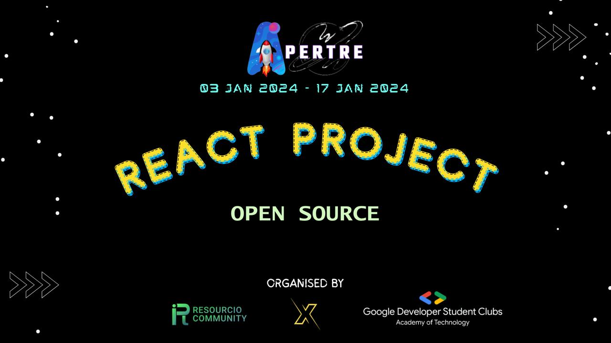

<h1 align="center"> Apertre React Project</h1>

 <div align="center">
 <p>

[](https://github.com/ellerbrock/open-source-badges/)


 </p>
 </div>

## Overview

This repository contains a React project called "Apertre React Project," which aims to create an Email Web Application named SnapSend. The project is based on a design provided in a Figma file, which can be accessed [here](https://www.figma.com/file/0hCMozlOme5gQibhakvTn3/SnapSend?type=design&node-id=3%3A573&mode=design&t=BtBkNAbYaVuZn1YK-1).

`Note: Since this is a community project, your contributions will go toward an open-source software project rather than someone else's project, allowing you to use pull requests and issues to learn more and contribute more.`

In this project we will be building a full stack Email App named SnapSend using the MERN Stack.

## Description

The "Apertre React Project" is a web application developed using React, designed to provide a user-friendly and efficient platform for managing emails. The project is built to replicate the design provided in the Figma file, ensuring a consistent and visually appealing user interface.

## Getting Started

To get started with this project, follow these steps:

1. Clone the repository to your local machine:

```bash
git clone https://github.com/your-username/apertre-react-project.git
```

2. Change your current directory to the project folder:

```bash
cd apertre-react-project
```

3. Install the project's dependencies using npm or yarn:

```bash
npm install
# or
yarn install
```

4. Start the development server:

```bash
npm start
# or
yarn start
```

This will launch the application in your default web browser, and you can access it at `http://localhost:3000`.

## Features

- Replicates the design provided in the Figma file.
- Allows users to manage their emails efficiently.
- Provides a user-friendly and visually appealing interface.

## Technologies Used

- React
- HTML/CSS
- JavaScript
- Figma (for design inspiration)

## Roadmap

The project is under active development, and future improvements may include:

- Authentication and user account management.
- Integration with email servers for sending and receiving emails.
- Additional features such as search, categorization, and labels.
- Responsive design for different screen sizes.

## Contributing

Contributions to this project are welcome. If you'd like to contribute, please follow these steps:

1. Fork the repository to your GitHub account.
2. Create a new branch with a descriptive name for your feature or bug fix.
3. Make your changes and commit them.
4. Push your branch to your forked repository.
5. Create a pull request to the main repository.

Please ensure your code adheres to the project's coding standards and practices.

## License

This project is licensed under the MIT License - see the [LICENSE](LICENSE) file for details.

## Contact

If you have any questions or need further information, you can reach out to the project maintainer:

- Name: [Your Name]
- Email: [Your Email]

---

Thank you for your interest in the "Apertre React Project." We hope this project is helpful and inspires you in your own web development journey.
